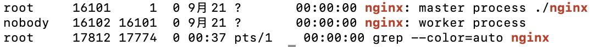

Linux 版本：CentOS 8.0 64位

在安装 nginx 前首先要确认系统中安装了 **gcc、pcre-devel、zlib-devel、openssl-devel**

安装命令：

```shell
yum -y install gcc pcre-devel zlib-devel openssl openssl-devel
```

nginx 下载页面：http://nginx.org/en/download.html

下载对应的压缩文件，移动到 `/usr/local` 下，我下载的版本是稳定版 [ nginx-1.18.0](http://nginx.org/download/nginx-1.18.0.tar.gz)

```shell
## 解压
tar -zxvf nginx-1.18.0.tar.gz

## 进入 nginx 目录
cd nginx-1.18.0/

## 配置
./configure

# make
make
make install
```

测试是否安装成功

```shell
# cd到刚才配置的安装目录/usr/loca/nginx/
./sbin/nginx -t
```

启动 nginx

```shell
cd ./sbin
./nginx
```

查看启动是否成功

```shell
ps -ef | grep nginx
```



接下来使用外部主机访问 IP（由于使用的是 80 端口，所以 IP 后面的端口号可以被省略），发现打不开链接。

首先

```shell
telnet ip 80
```

连接失败，说明 80 端口是打不开的，可以使用如下命令来验证：

```shell
firewall-cmd --query-port=80/tcp
```

返回 no，说明 80 端口没有开启，下面开启 80 端口

```shell
firewall-cmd --add-port=80/tcp --permanent
#重启防火墙
systemctl restart firewalld
```

刷新浏览器，发现还是打不开，继续排查，发现是因为阿里云的原因。

```
1、登录阿里云的管理控制台。找到那台云服务器；
2、在操作的部分点击更多，里面藏着一个安全组配置；
3、进入安全组配置后，点击配置规则；
4、然后点击公网入方向。默认里面有22和3389端口是打开的；
5、点击右上角的添加安全组规则；
6、在添加安全组规则的对话框里面，添加端口范围为80/80，添加授权对象为0.0.0.0/0，再点击确定按钮。这样在访问服务器IP，网站就正常显示了。
```

