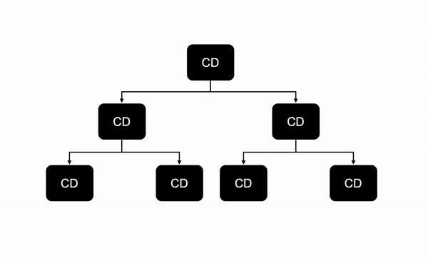
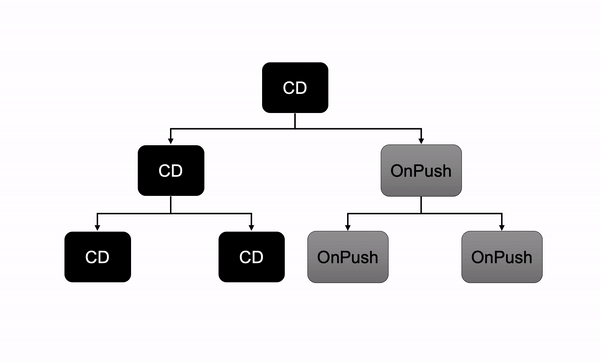

## What Is Change Detection

用一句话来说：

变更检测（Change Detection）：数据改变后更新 DOM 的过程（The process of updating the DOM when the data has changed）

作为开发人员，大多数时候我们不需要关心变更检测，除非我们需要优化应用程序的性能。 如果处理不当，变更检测会降低大型应用程序的性能。

## How Change Detection Works

一个变更检测周期可以分为两个部分：

- 开发人员更新 model
- Angular 通过重新渲染来在 DOM 中同步更新过的 model

让我们看一下更详细的步骤：

1. 开发人员更新数据模型，比如：更新一个组件绑定的值
2. Angular 监测到数据更改
3. 变更检测由上而下检查组件树中的每一个组件，来查看该组件相应的 model 是否已更改
4. 如果组件中的 model 有一个新值，就会更新组件的视图（DOM）



图片显示了 Angular 组件树及其在应用程序引导过程中为每个组件创建的更改检测器（CD）。 该检测器将当前值与属性的先前值进行比较。 如果该值已更改，它将 `isChanged` 设置为 true。Check out [the implementation in the framework code](https://github.com/angular/angular/blob/885f1af509eb7d9ee049349a2fe5565282fbfefb/packages/core/src/util/comparison.ts#L13) which is just a `===` comparison with special handling for `NaN`.

> 变更检测不会执行深度对象比较，它仅比较模板使用的属性的先前值和当前值。

### Zone.js

通常，zone 是为了跟踪并拦截任何异步任务。

Angular 在启动时修补了几个 low-level 浏览器 API，以便能够检测到应用程序中的更改。这是使用 zone.js 完成的，它修补了 EventEmiytter、DOM event listeners、XMLHttpRequest、Node.js 中的 fs API 等。

简单来说，如果发生下列事件之一，则框架将出发变更检测：

- 任何浏览器事件（click, keyup, etc.)
- `setInterval()` and `setTimeout()`
- HTTP requests via `XMLHttpRequest`

Angular 使用其称为 NgZone 的区域。 仅存在一个 NgZone，并且仅针对此区域中触发的异步操作触发更改检测。

## Performance

> 默认情况下，如果模板值已更改，则 Angular 变更检测将从上到下检查所有组件。

尽管 Angular 做了很多优化，但是当应用变的很大性能依然会下降。

### Change Detection Strategies

Angular 提供了两种策略来运行变更检测：

- `Default`
- `OnPush`

#### Default Change Detection Strategy

Angular 默认使用 `ChangeDetectionStrategy.Default` 变更检测策略。每当有事件出发变更检测时（比如用户事件、timer、XHR、promise 等），它会由上而下检查组件树中的每一个组件。这种不对组件依赖性进行任何假设的保守检查方法称为脏检查（dirty checking）。可能会对包含许多组件的大型应用程序性能产生负面影响。

#### OnPush Change Detection Strategy

可以通过在组件元数据上添加 `changeDectection` 属性为 `ChangeDetectionStrategy.OnPush` 来更改默认的策略。

```typescript
@Component({
  selector: 'hero-card',
  changeDetection: ChangeDetectionStrategy.OnPush
  ...
})
export class HeroCard {
  ...
}
```

这种更改检测策略可以跳过对此组件及其所有子组件的不必要检查。



使用这种策略时，Angular 仅在以下情况下才需要更新组件：

- input 的引用发生改变（只有当新的引用传给 `@input` 才会更新组件）
- 该组件或者子组件触发了事件处理程序
- 手动出发变更检测
- an observable linked to the template via the async pipe emits a new value

详细的这些情况可以参考 [这里](https://indepth.dev/the-last-guide-for-angular-change-detection-youll-ever-need/#changedetectionstrategies)


