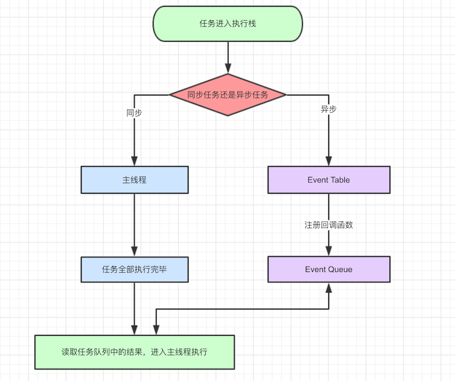
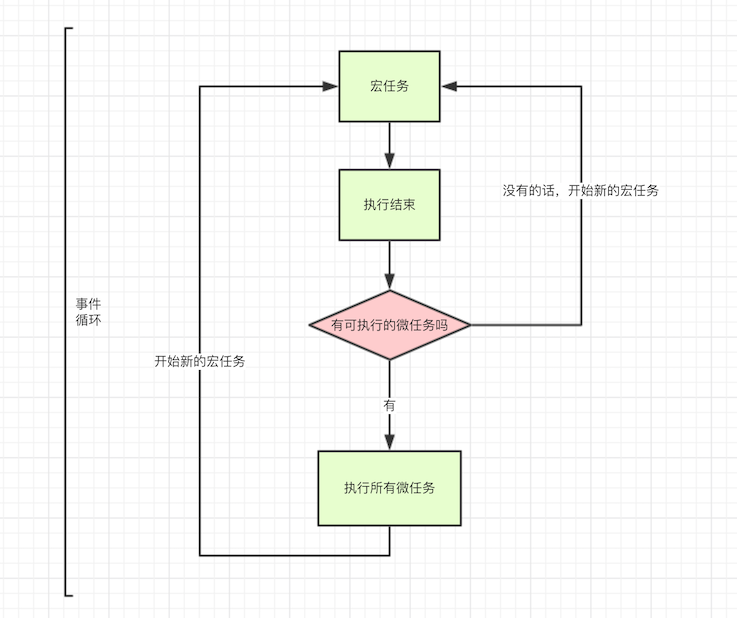

首先，JavaScript 是一门单线程语言。

JavaScript 中任务分为两种，**同步任务**和**异步任务**。

JavaScript 执行机制如下：

- 同步任务和异步任务进入不同的执行场所，同步的进入主线程，异步的进入 Event Table 并注册函数。
- 当指定的事情完成时，Event Table 会将这个函数移入 Event Queue。
- 主线程内的任务执行完毕为空时，会去 Event Queue 中读取对应的函数，进入主线程执行。
- 上述过程不断重复，就是所谓的事件循环（Event Loop）。

#### 宏任务和微任务

Event Queue 分成两种，宏任务和微任务，两种任务分别对应以下几种：

- 宏任务：setTimeout，setInterval，setImmediate，I/O，UI渲染，script整体代码

- 微任务：promise，process.nextClick

所以更详细的执行机制如下：

JavaScript 在运行时，先从宏任务队列开始执行，取出第一个宏任务放入执行栈执行。

在执行过程中，如果遇到宏任务，则将该宏任务放入宏任务队列中，继续运行执行栈中的后续代码。如果遇到微任务，则将该微任务放入微任务队列，继续运行执行栈中的后续代码。

当执行栈中的代码全部执行完成后，从微任务队列取出所有的微任务放入执行栈中执行。

执行完毕后，再从宏任务队列取出下一个宏任务放入执行栈，然后不断重复上述流程。

