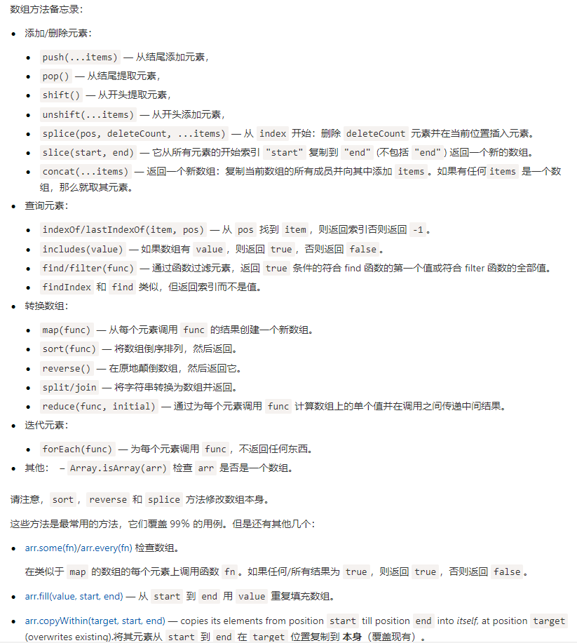

[TOC]

### 数组常用方法



#### 生成类似【1-100】这样的数组

在某些测试情况下经常会用到。

```js
let arr = new Array(100).fill(0).map((item, index) => index + 1);
```

#### 数组解构赋值

```js
[a, b] = [b, a]
[o.a, o.b] = [o.b, o.a]
```

#### 数组浅拷贝

```js
const arr = [1, 2, 3];
const arrClone = [...arr];
```

#### 数组合并

```js
const arr1 = [1, 2, 3];
const arr2 = [4, 5, 6];
const arr3 = [7, 8, 9];
const arr = [...arr1, ...arr2, ...arr3];
```

#### 数组取交集

```js
const a = [0, 1, 2, 3, 4, 5];
const b = [3, 4, 5, 6, 7, 8];

const duplicatedValues = [...new Set(a)].filter(item => b.includes(item));
```

#### 数组取差集

```js
const a = [0, 1, 2, 3, 4, 5];
const b = [3, 4, 5, 6, 7, 8];

const differValues = [...new Set([...a, ...b])].filter(item => !a.includes(item) || !b.includes(item));
```

### 数组常用遍历

数组常用遍历有 `forEach、every、some、filter、map、reduce、reduceRight、find、findIndex` 等方法，要学会灵活运用。

#### 遍历的混合使用(map, filter)

```js
const arr = [1, 2, 3, 4, 5];
const value = arr
    .map(item => item * 3)
    .filter(item => item % 2 === 0)
    .map(item => item + 1)
    .reduce((prev, curr) => prev + curr, 0);
```

#### 检查是否所有元素都符合判断条件(every)

```js
const arr = [1, 2, 3, 4, 5];
const isAllNum = arr.every(item => typeof item === 'number');
```

#### 检查是否有元素符合条件(some)

```js
const arr = [1, 2, 3, 4, 5];
const hasNum = arr.some(item => typeof item === 'number');
```

#### 找到第一个符合条件的元素/下标(findItem,findIndex)

```js
const arr = [1, 2, 3, 4, 5];
const findItem = arr.find(item => item === 3);
const findIndex = arr.findIndex(item => item === 3);
```

### 合理使用 Set 数据结构

```js
const arr = [...set];
```

### 强大的reduce

`array.reduce` 遍历并将当前次回调函数的返回值作为下一次回调函数执行的第一个参数。

利用 `array.reduce` 替代一些需要多次遍历的场景，可以提高代码运行效率。

假如有如下每个元素都由字母‘s'加数字组成的数组 `arr`，现在找出其中的最大数字：

```js
const arr = ['s0', 's4', 's1', 's2', 's8', 's3'];

// 多次遍历
const newArr = arr.map(item => item.substring(1)).map(item => Number(item));
const maxS = Math.max(...newArr);

// 使用 reduce 一次遍历
const maxS = arr.reduce((prev, curr) => {
    const curIndex = Number(curr.replace('s', ''));
    return curIndex > prev ? curIndex : prev;
}, 0);
```

```js

// 多次遍历
const value = arr.filter(item => item % 2 === 0).map(item => ({ value: item }));

// reduce
const value = arr.reduce((curr, prev => {
    return curr % 2 === 0 ? [...prev, curr] : prev;
}), []);
```

